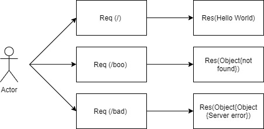

# server-deployment-practice
Class401 - Lab01

[Heroku-deployment](https://samer-server-deploy-prod.herokuapp.com/);

[Heroku-dev](https://samer-server-deploy-dev.herokuapp.com/);

[GitHub Action](https://github.com/Samer-Alnajjar/server-deployment-practice/actions);

[Pull Request](https://github.com/Samer-Alnajjar/server-deployment-practice/pull/4);

**UML Diagram**

- How do I install the app or library?
  1. Clone the repo from git hub, by run the following command "git clone -repo-".
  2. Run "npm init -y".
  3. Run "npm i".
  4. Create .env file and PORT inside it.
- How do I test the app or library?
  - Just run "npm test"

For Applications:
  - How do I run the app?
    - Run "npm start" or "node index.js"
  - How do I set up the app?
    1. Clone the repo from git hub, by run the following command "git clone -repo-".
    2. Run "npm init -y".
    3. Run "npm i".
    4. Create .env file and PORT inside it.
    5. Then run "npm start"